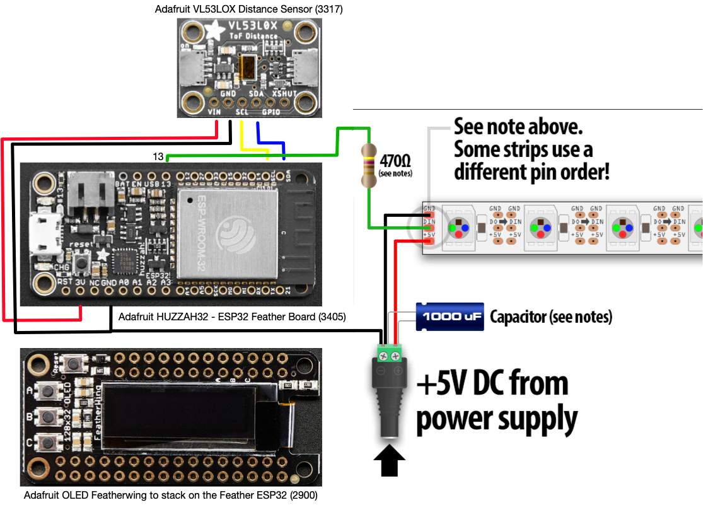

# neopixel_frame
An interactive Neopixel lit frame.

This code is running on an [Adafruit HUZZAH32 ESP32
Feather](https://www.adafruit.com/product/3619) with the [OLED
HAT](https://www.adafruit.com/product/2900)  and the
[VL53LOX](https://www.adafruit.com/product/3317) laser range finder.
The frame has a [RGBW Neopixel string](https://www.amazon.com/gp/product/B079ZWR5SZ) 
running around the inside of the frame illuninating the "art" or 
whatever is in the frame.  If the sensor doesn't see anything nearby, 
it just lights the white LEDs in the string.  If it detects an object, 
it uses the distance to change the hue of the LEDs.

There is also a Web server that a user can connect to via the code
to make this an Wireless Access Point.  There are buttons (and
eventually sliders) that can change the colors and brightness of
the frame.

Libraries needed:
* foo
* bar
* foo

## Wiring 

## Frame Construction

